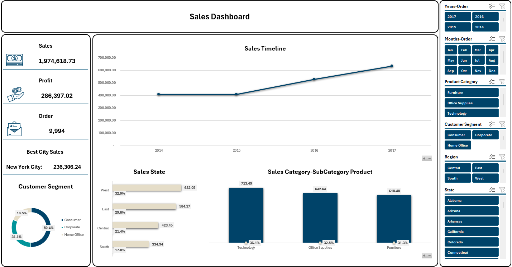
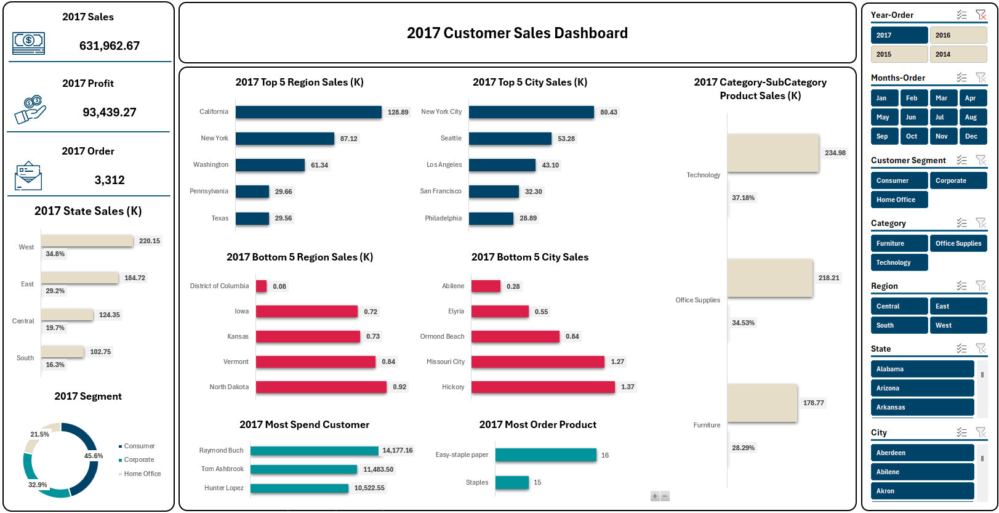
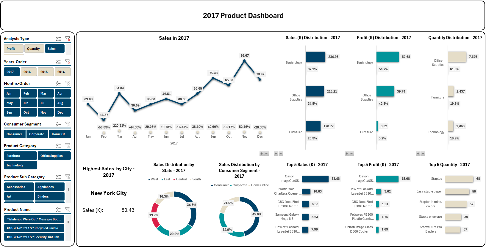

# Sales Analytics Project

## Project Description
The **Sales Analytics** project aims to provide a comprehensive analysis of sales performance, customer behavior, and product distribution over time. By utilizing powerful data processing and visualization tools, the project enables decision-makers to gain actionable insights for strategic business improvements.

### Objective
The main objective of this project is to analyze and visualize sales data from multiple dimensions, including:
- **Sales Summary**: Overall revenue, profit, and number of orders
- **Customer Analytics**: Regional performance, top cities, customer segments, and purchasing behavior
- **Product Performance**: Sales by product category, sub-category, and individual product, including distribution by sales volume, profit, and quantity

## Tools and Technologies Used
- **Power Query**: For data extraction and transformation (ETL process)
- **Power Pivot**: For data modeling and establishing relationships
- **Pivot Tables & Charts in Excel**: For interactive visualizations
- **Slicers & Filters**: To enable dynamic data exploration

---

## Dashboards Overview

### 1. Sales Summary Dashboard
This dashboard provides a macro-level overview of total sales performance between 2014 and 2017. Key insights include:
- **Sales Timeline** displaying annual growth
- **Key Metrics**: Total Sales, Profit, and Orders
- **Top-Performing City**: New York City
- **Sales Distribution by State and Customer Segment**
- **Performance by Product Category**

---

### 2. Customer Sales Dashboard
Focused on customer data, this dashboard highlights:
- **Top and Bottom 5 Regions and Cities by Sales**
- **Customer Segment Analysis**
- **Most Valuable Customers**
- **Most Frequently Ordered Products**

This view provides a deeper understanding of the market behavior and regional trends.

---

### Product Performance Dashboard
This dashboard presents an in-depth analysis of product-related sales and trends, including:
- **Monthly Sales Trend**
- **Sales, Profit, and Quantity Distribution by Product Category**
- **Top 5 Products by Sales, Profit, and Quantity**
- **Sales Distribution by State and Customer Segment**

These insights help identify best-performing product lines and customer preferences.

---

## Dataset Overview
The dataset contains sales transaction records, including:
- Order Dates and Amounts
- Customer Demographics (Region, Segment)
- Product Information (Category, Sub-category, Product Name)
- Profit and Quantity Metrics

> **Source**: Public sample dataset hosted on GitHub  
> [View Dataset on GitHub]([superstore](https://github.com/denindrap23/Excel/blob/main/Sales%20Analytics/dataset/superstore.csv)

---

## Key Features
- Fully interactive dashboards with slicers for filtering by year, month, region, category, segment, and product
- Real-time drill-down analysis for more granular insights
- High-level KPIs with visual indicators
- Year-over-year comparison

